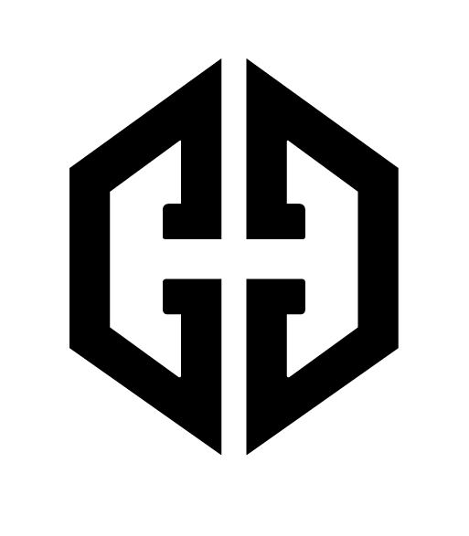

# CUSCUS HATS — Drop Platform

**La plataforma de lanzamientos de ediciones limitadas de Cuscus Hats**

*Sé el primero en enterarte. Sé el primero en tenerla.*

---

---

## Sobre el proyecto

Este proyecto fue desarrollado y entregado a **Cuscus Hats**, una marca de gorras de edición limitada. Se trata de una plataforma web de lanzamiento (*drop*) construida a medida para la marca, con estética oscura, tipografía gótica y animaciones inmersivas.

---

## ¿Qué incluye la plataforma?

### 🎩 Landing del Drop
Página principal con fondo inmersivo, grain de película, viñeta y tipografía blackletter. Todo diseñado para comunicar exclusividad desde el primer scroll.

### ⏳ Contador Regresivo
Cuenta regresiva en tiempo real hacia la fecha del próximo drop. La fecha se puede actualizar en cualquier momento sin modificar la página.

### 📋 Formulario de Pre-registro
Los interesados dejan su número de teléfono y correo electrónico para recibir alertas del lanzamiento. Se valida que no haya registros duplicados.

### 🌟 Animaciones inmersivas
- **Estrellas** — Campo de 160 estrellas con parpadeo aleatorio
- **Estrellas fugaces** — Cruzan la pantalla a intervalos aleatorios con cola luminosa
- **Grain cinematográfico** — Textura de grano superpuesta para una estética de película

---

## Roadmap

- [x] Landing page inmersiva con fondo, grain y viñeta
- [x] Estrellas y estrellas fugaces animadas
- [x] Contador regresivo en tiempo real
- [x] Formulario de pre-registro con validación
- [x] Diseño completamente responsivo
- [ ] Panel de administración del drop
- [ ] Envío de correos automáticos al momento del lanzamiento
- [ ] Página de producto con galería del drop

---

## Licencia

Todos los derechos reservados © 2026 — Cuscus Hats. Proyecto de uso privado para la marca.

---

*World Is Yours*

